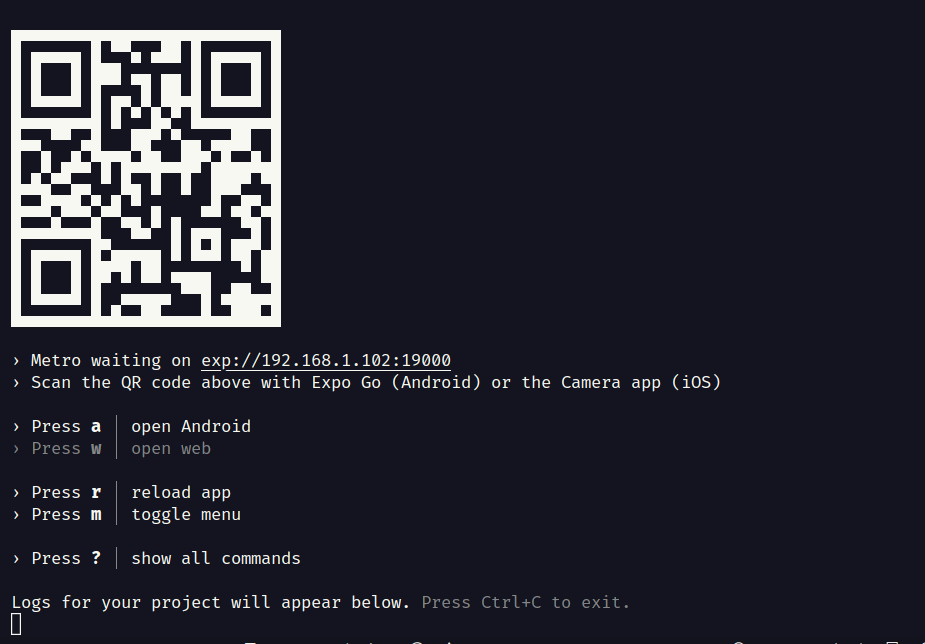

## Processo seletivo CodeLeap

Esse projeto tem a finalidade de mostra meus conhecimentos em desenvolvimento Front end com Reactjs e React Native com Typescript.

Foi desenvolvido uma pagina e aplicativo de publicação de mesagens.

### :rocket: Tecnologias utilizadas:

- O React (também denominado React.js ou ReactJS) é uma biblioteca front-end JavaScript de código aberto com foco em criar interfaces de usuário em páginas web.

- Criado em 2011 pelo Facebook, com a criação de views declarativas e baseando-se em componentes, possuía o intuito de otimizar a atualização e a sincronização de atividades simultâneas no feed de notícias da rede social e melhorar a manutenção de código.

- É uma biblioteca JavaScript de software livre projetada para criar aplicativos front-end que facilitam o desenvolvimento de aplicativos de página única (SPA). Mantida pelo Facebook e pela comunidade de software livre, esta biblioteca é muito rica e cheia de plugins para adicionar ao seu aplicativo.

- React Native é uma biblioteca Javascript criada pelo Facebook.[2] É usada para desenvolver aplicativos para os sistemas Android[3] e iOS de forma nativa.
- Os princípios de funcionamento do React Native são virtualmente idênticos ao ReactJs, exceto que o React Native não manipula o DOM através do Virtual DOM. Ele é executado em um processo em segundo plano (que interpreta o JavaScript escrito pelos desenvolvedores) diretamente no dispositivo final e se comunica com a plataforma nativa por meio de uma serialização, uma ponte assíncrona e em lote.

- É um conjunto de ferramentas e serviços construídos em torno de plataformas nativas e React Native que ajudam você a desenvolver, construir, implantar e iterar rapidamente em aplicativos iOS, Android e web a partir da mesma base de código JavaScript/TypeScript.

<pre>React Navigation</pre>

- O React Navigation é responsável por resolver uma grande questão de suas aplicações: a navegação. Influenciando na experiência da pessoa usuário e no design do app, a navegação e pode tornar tudo mais fácil ou mais complexo.

- Porém o React Native não apresenta uma solução para o roteamento de forma nativa. Então, o React Navigation é uma possibilidade para realizar isso de forma simples e que você vai conhecer em detalhes neste artigo.

- Typescript devido ser uma linguagem que ajuda garantir a qualidade do código, apontando erros no desenvolvimento da aplicação proporcionando maior segurança.

- Axios é um cliente HTTP baseado-em-promessas para o node.js e para o navegador. É isomórfico (= pode rodar no navegador e no node.js com a mesma base de código). No lado do servidor usa o código nativo do node.js - o modulo http, enquanto no lado do cliente (navegador) usa XMLHttpRequests.

- O React Router Dom é uma biblioteca para o React criada com o objetivo de resolver problemas de rotas para as páginas de um site e tornar o desenvolvimento muito mais simples e escalável. Com ela, podemos declarar caminhos do nosso site para renderizar componentes e até mesmo resolver parâmetros na URL.

- O date-fns é uma biblioteca para formatar e calcular datas de uma forma menos assustadora para os desenvolvedores considerado uma alternativa valiosa ao Moment.js não apenas porque oferece o mesmo conjunto de recursos, mas também porque é atraente para programadores funcionais. Além disso, o date-fns tem um tamanho de pacote menor em comparação com o Moment.js, o que o torna mais fácil de usar em projetos com limitações de tamanho.

- ESLint para identificar erros e automatizar a padronização do código do projeto.

- Redux é uma biblioteca para armazenamento de estados de aplicações JavaScript, criado por Dan Abramov. Ele nasceu através de uma implementação do Flux, uma arquitetura criada pelo Facebook para contribuir com as aplicações de User Interface, utilizando o conceito de fluxo de dados unidirecional. Quando desenvolvemos aplicações utilizando Javascript, sempre temos que lidar com o gerenciamento de estado. O Redux veio para suprir essa necessidade de simplificar o controle dos estados de uma aplicação. Compartilhar estados entre vários componentes diferentes se torna uma coisa muito fácil quando o utilizamos.

- O Styled Components é uma biblioteca (lib) do React e do React Native que nos permite criar componentes de estilo ao escrever códigos CSS dentro de um arquivo JavaScript.

- O modo de estilizar um componente utilizando a biblioteca Styled Components também é conhecido como CSS-in-JS (CSS dentro do JavaScript).

#### :hammer: Executar Aplicação

### Web

1- Deploy da aplicação: https://code-leap-woad.vercel.app/

### Web Local

1- Realizar o clone desse projeto.

2- Abrir o terminal na pasta do projeto escrever o comando:

- `cd web`

3- Depois escrever o comando no terminal:

- `npm install`

4- Ao final da instalação escrever o comando no terminal:

- `npm run dev`

5- No terminal mostrar uma url copie e cole no seu navegador de preferencia.

###Mobile

1- Realizar o clone desse projeto.

2- Abrir o terminal na pasta do projeto escrever o comando:

- `cd mobile`

3- Depois escrever o comando no terminal:

- `npm install`

4- Ao final da instalação escrever o comando no terminal:

- `expo start`

##### Usando um cabo USB

1- No sistema operaciona windows/linux o expo so funciona em celulares android.

2- No sistema operaciona MAC o expo funciona so em celulares ios.

3- Com o cabo conectado ao Computador

4- Para rodar no celular com android no terminal aperta a letra

- `a`

5- Para rodar no celular com ios no terminal aperta a letra

- `i`

##### Usando QRCODE

1- Instalar o aplicativo expo no seu celular.

2- Abrir o aplicativo.

3- Selecionar Scan QR code.

4- Realizar a leitura do QRCode que mostra no terminal exemplo abaixo.

5- Aproveitar o aplicativo :D.

## Contato

  
  

